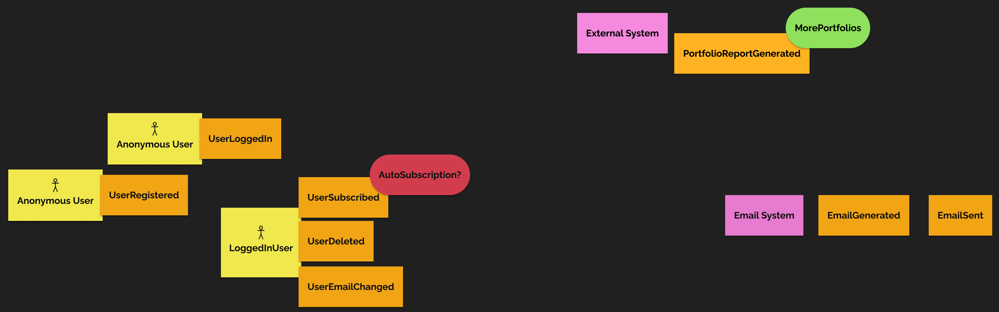
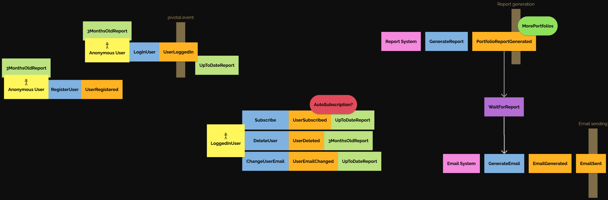

# Solution for `Task1`

## Assignment
```
Our client, the stock advisory company, provides services of stock market analyses,
stock monitoring and stock recommendation.

More and more of their clients ask for news about ARK invest ETFs funds and want to
know what CEO Cathie Wood buys and sells.

So far, their analysts go every month to https://ark-funds.com/funds/arkk/ download
the full holding in CSV, do the diff in Excel and send it via email to their clients.
The diff looks like this:

New positions:
Company name, ticker, #shares, weight(%)

Increased positions:
Company name, ticker, #shares (🔺x%), weight(%)

Reduced positions:
Company name, ticker, #shares (🔻x%), weight(%)

Your task is to work with the stock advisory company to help them automate it.
This company has been our customer for a long time. This is not a fixed scope project.
Both parties agree to cooperate and adjust plans as needed in an agile way.
Our ultimate goal is satisfied customer.
```
---
## Our solution

# Event storming


---


# User stories


