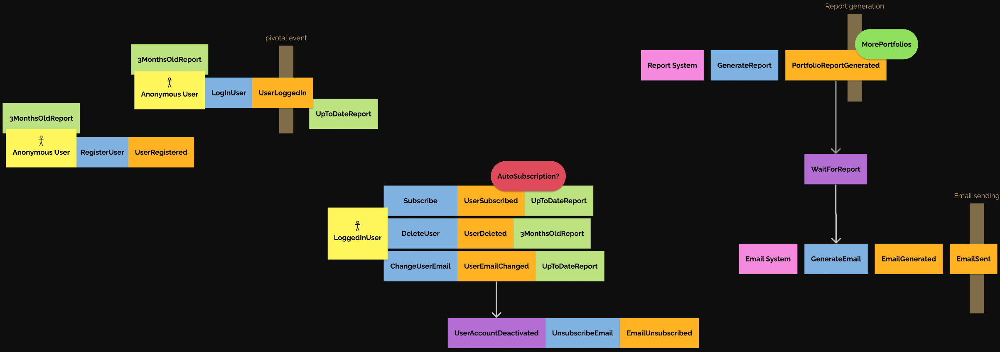

# Solution for `Task1`

## Assignment

```
Our client, the stock advisory company, provides services of stock market analyses,
stock monitoring and stock recommendation.

More and more of their clients ask for news about ARK invest ETFs funds and want to
know what CEO Cathie Wood buys and sells.

So far, their analysts go every month to https://ark-funds.com/funds/arkk/ download
the full holding in CSV, do the diff in Excel and send it via email to their clients.
The diff looks like this:

New positions:
Company name, ticker, #shares, weight(%)

Increased positions:
Company name, ticker, #shares (🔺x%), weight(%)

Reduced positions:
Company name, ticker, #shares (🔻x%), weight(%)

Your task is to work with the stock advisory company to help them automate it.
This company has been our customer for a long time. This is not a fixed scope project.
Both parties agree to cooperate and adjust plans as needed in an agile way.
Our ultimate goal is satisfied customer.
```

---

## Our solution

# Event storming

## 



# User stories

## User Stories for Account Management

---

## User Registration

**As a prospective user, I want to register for an account, so that I can access restricted features.**

### Acceptance Criteria:

- Works with standard email and password combination.
- Provides password strength feedback.
- Confirms email address through verification email.

### Out of scope:

- Registration using OAuth services like Google or Facebook.
- Two-factor authentication setup during initial registration.

### Notes:

- Ensure GDPR compliance for user data collection.

### Estimation:

Planning poker: 5 (considering standard complexity for user registration).

---

## User Login

**As a registered user, I want to be able to log in to my account, so that I can access my personal settings and data.**

### Acceptance Criteria:

- Works with email and password.
- Includes "Forgot Password" feature.

### Out of scope:

- Biometric login options.
- "Remember me" feature for device authorization.
- Supports OAuth login methods like Google or Facebook.

### Notes:

- Implement login rate-limiting to prevent brute force attacks.

### Estimation:

Planning poker: 3

---

## Change User Email

**As a logged-in user, I want to be able to change my registered email address, so that I can keep my contact information up to date.**

### Acceptance Criteria:

- Users can initiate email change from account settings.
- Verification of the new email address is required.
- Users are notified at their old email address about the change.
- Immediate session invalidation after email change for security.

### Out of scope:

- Changing other personal information at the same time as email.
- Email change via customer support.

### Notes:

- Any changes should be logged for audit purposes.
- Provide clear instructions for email verification process.

### Estimation:

Planning poker: 2 (straightforward process but requires proper security measures).

---

## Deactivate User Account

**As a user, I want the option to deactivated my account, so that I won't receive any more e-mail reports.**

### Acceptance Criteria:

- Provide a clear and easy way to initiate account deactivation from settings.
- Confirm the deactivation action via password.
- Inform the user that they won't receive any more reports.

### Out of scope:

- Account recovery after deactivating.

### Notes:

- Clear instructions and warnings of deactivating their account.
- The platform should comply with relevant privacy regulations regarding user data deletion

### Estimation:

Planning poker: 4

---

## Subscribe to report

**As a logged-in user, I want to be able to subscribe to e-mail portfolio reports, so that I can keep up with the portfolio updates outside of the website comfortably in my e-mail.**

### Acceptance Criteria:

- The feature should be accessible only to logged-in users.
- Notify the user on their e-mail about the creation of a new subscription.
- User is able to view the current subscription.

### Out of scope:

- Subscription management section within users account settings.

### Notes:

- Ensure the emails are well-formatted, concise, and contain only relevant information.

### Estimation:

Planning poker: 3


---

## Show report

**As a logged-in user, I want to view detailed reports of ARK Invest ETFs holdings, so that I can make informed investment decisions.**

### Acceptance Criteria:

- The feature should be accessible only to logged-in users.
- Users can see report details on their main dashboard

### Out of scope:
 - Predictive analytics or investment advice based on report data.
 - Integration with external portfolio management tools or platforms.
 
### Notes:
- Consider implementing a responsive design for the reports to ensure usability across different devices, including tablets and smartphones.

### Estimation:

Planning poker: 3